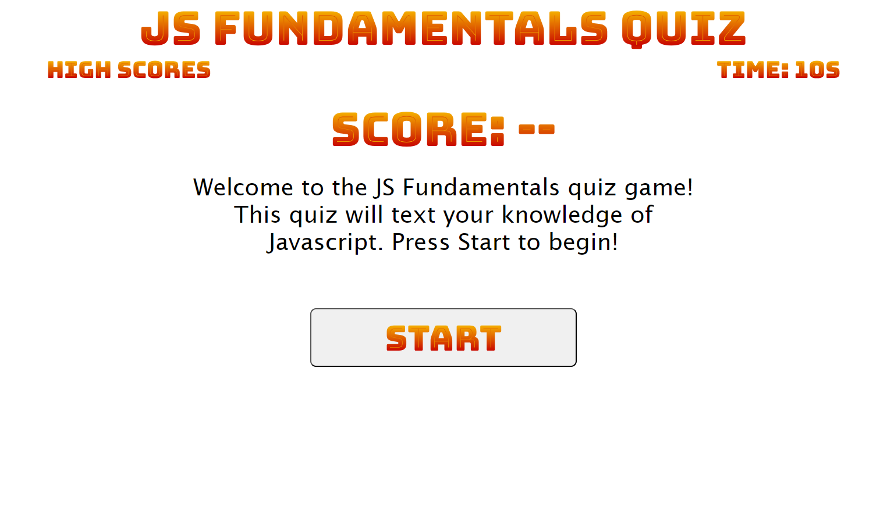

# js-fundamentals-quiz 📜

A website dedicated to testing your knowledge of the programming langauge Javascript! It is a timed quiz with visual feedback if a question is not selected. Questions are worth 100 points and you can save your score locally to compete against friends. The quiz can be taken here: https://mforte215.github.io/js-fundamentals-quiz/

## Table of Contents (Optional)

- [Installation](#installation)
- [Usage](#usage)
- [Credits](#credits)
- [License](#license)

## Installation

N/A

## Usage

The purpose of this website is to help the user test their knowledge of Javascript. It asks the user a series of questions that asks basic information regarding the langauge and its associated features.

Link to the website deployed on GitHub Pages: https://mforte215.github.io/js-fundamentals-quiz/

Link to the code repository on GitHub: https://github.com/mforte215/js-fundamentals-quiz

A screenshot of the current site:

## Credits

N/A

## License

Please refer to the LICENSE in the repo
